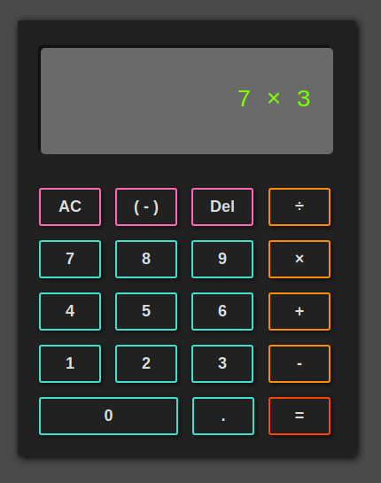

# Calculator

A webpage that contains a calculator. This was the final project built for the **Foundations** path of The Odin Project [curriculum](https://www.theodinproject.com/lessons/foundations-calculator).

My **live demo** can be found [here](https://latsonj.github.io/calculator/).

## Technologies used

 - **HTML5**
 - **CSS3**
 - **Vanilla** JS

## Screenshots

   

## Learning Observations

This was the final project of the **Foundations** section of the Odin Project and really hammered home the concepts of **DOM Manipulation** and **Event listeners**. This project was also a chance to get practice on all the methods and important learning points that I've used up until this project.

This project felt like building mental muscle memory for all of the learning done so far since it *was* the final **Foundation** project. I enjoyed building the project and going through the process of writing code, figuring out what works and the *wiring up* of the project. Again, like with previous projects, I enjoyed styling the project and writing its stylesheet. However, I can still make huge improvements to the **readability** of my code since I have *nested if statements* and *too many comments* (to explain what I'm doing to myself).

I think my project is good, but not *great*. I have another branch open to try and improve code readability.

## Potential Future Improvements

  - In the process of *refactoring* on another branch to make more readable code

  - Keyboard support
  - Negative sign toggling negative sign instead of relying on toggle button

## Attributions
This project was created with fonts and images from:

 - [Calculator icons created by srip - Flaticon](https://www.flaticon.com/free-icons/calculator)

## Author

Created by [latsonj](https://github.com/latsonj)